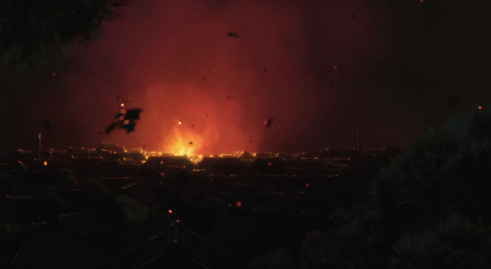
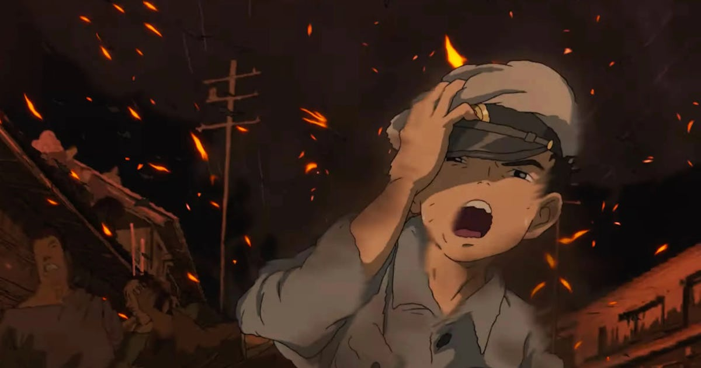
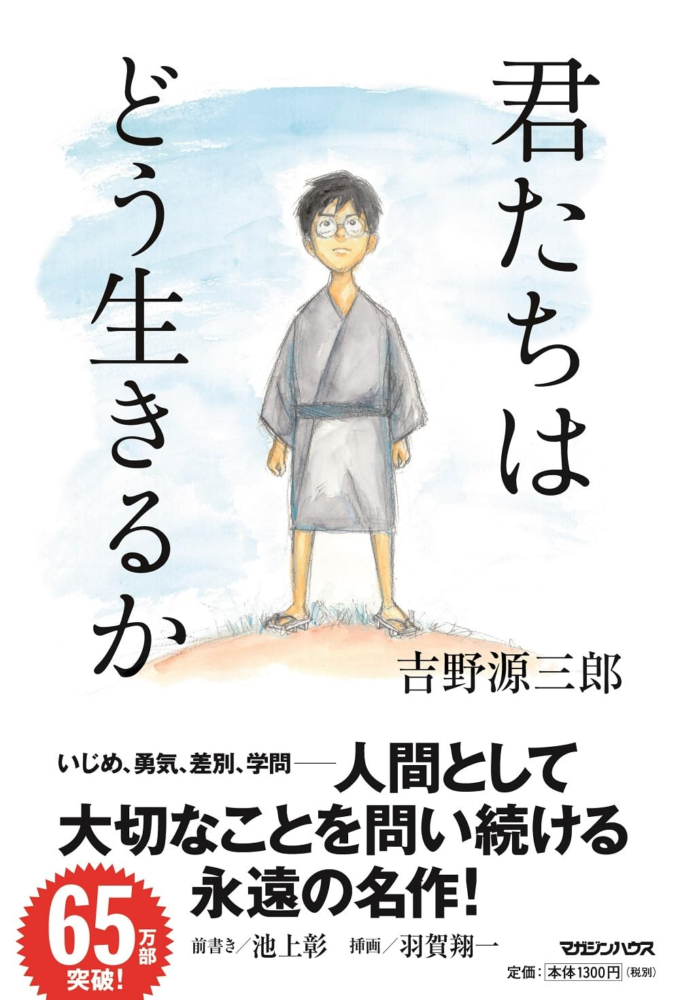
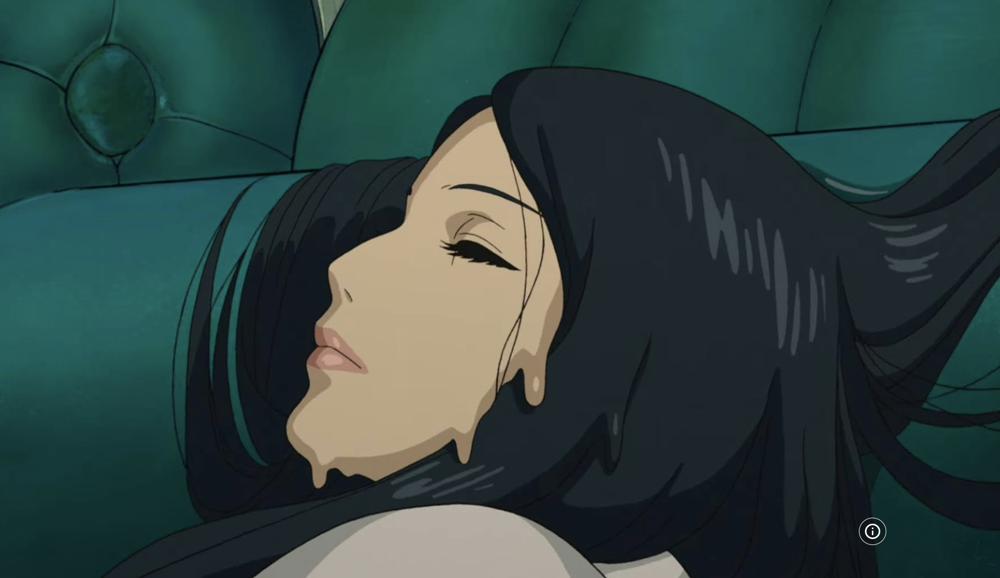
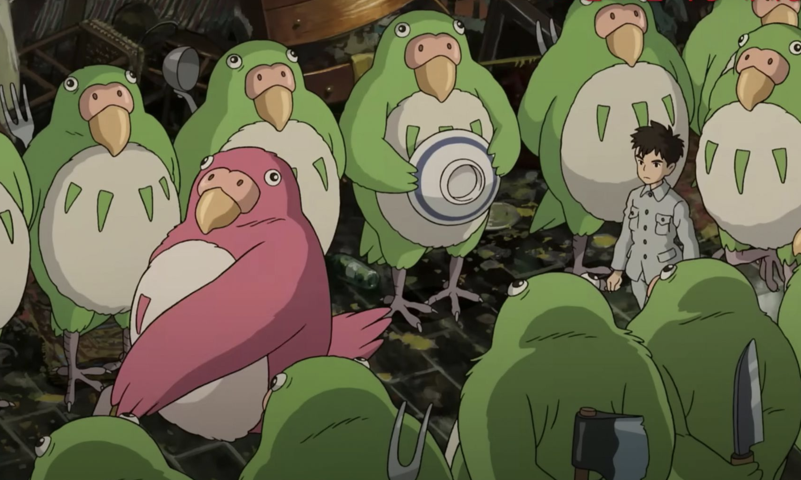

Skip to actual essay => [The Boy and the Heron](#the-boy-and-the-heron)

# Introduction

Now feels like a good time to revisit my old essay about *The Boy and the Heron*, in this era of ChatGPT-powered Ghibli photos flooding the Internet for three days before everyone gets bored and moves on to the next bullshit. 

It brings to mind a popular screencap from the Ghibli documentary that pops up every now and then, in which Hayao Miyazaki says that he "strongly feel[s] that [AI] is an insult to life itself." The oft-omitted context is the demo AI animation he was shown, which depicted a contorted body dragging itself by the head. The exhibitor explained that AI could be used for zombie movements and other hard-to-imagine concepts. 

In response, Miyazaki told this story:

> Every morning, not in recent days, I see my friend who has a disability. It's so hard for him just to do a high five; his arm with stiff muscle can't reach out to my hand. Now, thinking of him, I can't watch this stuff and find it interesting. Whoever creates this stuff has no idea what pain is. [I would] never wish to incorporate this technology into my work at all.

Although the context differs from today's AI hype cycle, the sentiment still applies. "Insult to life itself" is not just a quirky insult from a quaint old jaded, cigarette-smoking Japanese animator. It's a stance on the purpose of making and sharing art: Miyazaki believes it is meant to be a conscious reflection on what it means to live as a human. Considering his subject matter and own biographical details, it is clear that he is concerned with daunting questions such as what drives humans to destroy nature, enthusiastically produce weapons of war, and kill. His father, after all, manufactured rudders for Japanese fighter planes during WWII, and his childhood was characterized by post-war desolation. Miyazaki's art style reflects this: characters cringe and contort their faces in laughter, gluttony, and anger; the elderly grow wrinkled, melancholy, and stout; humans transform into animals and monsters. Beyond the memorable painterly settings, this is why people feel so much when they watch Ghibli movies.

Of course, even though Miyazaki is a defining master of our time, this view of art is his own and not an absolute statement on what art should be. But it explains his perspective on AI. The soul in our image diffusion models does not understand human life beyond a cute art style that bears some surface-level resemblance to Ghibli movies. People are rendered with smooth, young faces; identical smiles; and slim bodies. It's a glorified Instagram filter. Personally, when I see these generated images, I don't feel anything, whether it's a smiling couple's photo or a person being deported. And there are so many of these generated images that already, no one cares about them anymore. 

But there's no point in bemoaning the inevitable. I already get tons of artificial content when I do an image search for the most basic things. We are entering an age where visual aesthetics don't matter that much. Setting aside the loss of artistic jobs, I guess that's okay--caring or not caring about art is a cultural value dictated by the rich, neither a moral value nor a necessary social good, even if it feels nice to walk around an art museum. 

The fine arts have always been a function of what the wealthy and powerful in society desire, whether jade idols of the Mayan sun god or marble busts of Roman emperors. Art is not an organic production springing forth from a collective striving for beauty. You need money for artists, schools for honing techniques, treasure troves of gold and ivory and bronze and paint... Today's social elite seem to care for other things. And although I'm grateful to the Medicis for what they've done for art, I wouldn't say their world was better than ours. 

Anyway, I find it funny to imagine the youth of the 2100's going to the MoMA and skipping past the gallery of the 21st century because it sucks.

---

# *The Boy and the Heron*

When I walked into the movie theatre to see *The Boy and the Heron*, I knew three things: that Miyazaki claimed it was his last movie, that he dedicated it to his grandson, and that it has a strong anti-war message--as my officemate suggested, potentially his most emphatic anti-war movie yet. I was surprised by this claim, considering that the first line of *Grave of the Fireflies* is: "September 21, 1945... that was the night I died."

This movie opens with the night sky of wartime Tokyo illuminated by fire, burning scraps of paper floating on wind currents. A hospital has been bombed in an air raid–-the same hospital where the sick mother of the young Mahito is staying. He sees the fire from his window and, horrified, runs out of the house and through war-torn streets, trying to reach her, to somehow save her, only to watch the whole building explode into flames before his eyes.

The title card then flashes on the screen. It was at that moment, sitting in the movie theatre, that I learned that I didn't know the title of the movie. It read: 君たちはどう生きるか, kimi-tachi wa dou ikiru ka. I was shocked not just that the title was totally different from the English translation, but also that I could actually read it with the ruins of my Japanese knowledge. "How do you live?" That's the real title, with "you" being the second-person plural.

After a timeskip of a few years, Mahito’s father marries his dead wife’s sister, who conveniently looks almost identical to his dead wife. He moves his family to the countryside and builds his budding career as a military industrialist. Mahito has grown to be a quiet, serious schoolboy with no friends, and recurring flashbacks to the traumatic night of his mother’s death. 

In his new home, a sinister enchanted heron recognizes Mahito and taunts him about his dead mother. It speaks with a raspy voice, its head grotesquely unfolding to reveal a fleshy human mouth with giant teeth.

Enraged, Mahito prepares to fight the heron, going into his father’s library to study the making of a bow and arrow. In the process, he happens across a book with a handwritten note from his mother, addressed to him, stating that it is a gift for him when he is older. The book is titled: *How Do You Live?* He reads it in one sitting, teardrops falling onto the pages by the end.

# *How Do You Live?*

The library scene was both filled with such intention and a total non-sequitur from the plot, which convinced me that it had to be a real book. And so, I found that the first *How Do You Live?* is a children’s book published in 1937 by a staffer at a publishing company named Genzaburou Yoshino. He was originally asked to write a primary school ethics textbook. Yoshino turned it into a coming-of-age novel, possibly to make the lessons into something kids would actually remember; or to evade the *Tokkou*, the Japanese thought police, who would have suppressed the liberal, Western ideas he espoused. Or perhaps both. In any case, the plot of Miyazaki's movie is not at all the same as that of Yoshino's book, but there exists a thread of inspiration.

Many criticisms of Miyazaki's movie center on its lack of coherence or a clear plot. I believe that it’s most similar to what it means to live. There are all kinds of loose ends and unsatisfying conclusions. People are disappointing, life is disappointing. Nothing is ever neat.

But in this respect, Yoshino’s book is the polar opposite–it clearly articulates a wide range of moral lessons and takeaways. The format is unlike that of any other children’s book I’ve read. The story centers on Copper, a mischievous, precocious schoolboy who is raised by his widowed mother. Shortly before Copper’s father died of illness, he made a special request to his brother-in-law to look after the boy, saying: “I want him to become a great man! A fine example of a human being.” Copper’s uncle takes this wish to heart, putting effort into spending time with him and teaching him. The story is interspersed with letters the Uncle writes to a more mature Copper, drawing ethical lessons from Copper’s experiences to guide him as he grows as a human. 

The Uncle's lessons range widely: from reflections on poverty and economic relations, to a psychological portrait of Napoleon’s rise and fall; a discussion of Gandharan Buddha sculptures as a demonstration of a centuries-long symbiosis of East and West, to an argument for peace motivated by Blaise Pascal’s writing on human greatness. The following is an example of some of this writing:

> If it weren’t natural for people to live together in harmony, then why would we suffer when we felt a lack of harmony? If we should try to live a life of love and goodwill toward others but instead find ourselves driven by hatred and hostility, we feel unfortunate because of that, and for that reason, we suffer.

> Furthermore, anyone should be able to cultivate their own talents and to work according to those talents, so people suffer when they can’t do that, and feel they can hardly endure it.

> People feel sad and suffer like this because it’s not natural to have such hatred and hostility toward each other. Also, because it’s wrong that they cannot freely cultivate the talents with which they were born.

> [...]

> Naturally, pain is not unique to human beings. Even dogs and cats may shed tears if wounded, and when they are lonely, they howl piteously. When it comes to physical pain or hunger or thirst, humans are surely the same as other animals. That’s why we experience a keen sense of empathy and feel great affection for other living creatures on the planet, be they dogs, cats, horses, or cows. But that also means that pain alone tells us little about what it means to be truly human.

> We learn true humanity from a pain that only humans feel, even in the midst of experiencing all the same pain as other living things.

Yoshino’s intellectual yet down-to-earth writing represents a hope that children are capable of feeling for and learning his lessons on thinking for yourself; on striving for the good of all humanity; on empathy and peace. If today’s children are capable of this, then surely the people of tomorrow can be better, and the world will slowly progress both morally and socially. Yoshino’s book closes with Copper beginning a notebook of his own, resolving to write his impressions of life just as his Uncle did for him. He writes:

>  I think there has to come a time when everyone in the world treats each other as if they were good friends. Since humanity has come so far, I think now we will definitely be able to make it to such a place. So I think I want to become a person who can help that happen.

The truth of Yoshino's world in Japan, 1937, however, was that of the Japanese invasion of China and the launch of WWII military campaigns in the Pacific Theatre. 

Even before this point, Japanese ultra-nationalism had been growing in fervor for decades. It was in 1919 that Ikki Kita published his militaristic manifesto *An Outline for the Reorganization of Japan*. Secret societies proliferated throughout the country in the 1920’s, clamoring for Japanese cultural chauvinism and a totalitarian military state led by the emperor, who was revered as a god. In 1931, Japan invaded Manchuria and installed a colonial puppet regime. That same year, Yoshino, then a fresh university graduate with a degree in philosophy and literature, was imprisoned for 18 months for involvement with socialist thinking.

Yoshino's book was published right on the precipice of the deadliest conflict in human history. Tens of millions would perish, and somehow the world kept spinning on, immediately careening into another war and the proliferation of new weapons capable of razing the Earth many times over. Humans failed to rid themselves of the chauvinistic ideas that those of other races are intrinsically worth less. 

And so, how is it possible to still hope for a better world? How do you live?

This question, in its different facets, is the crux of the relationship between Yoshino’s and Miyazaki’s work. Where Yoshino asks how to live to become a good person, one who makes the world better through their relationships with other people, Miyazaki questions how it is possible to live in a senseless, hopeless world, where good people act with violence and greed; where people build weapons of war without questioning the way it distorts their souls.

These differing perspectives can also be read as emerging from their respective historical moments: before the bloodshed of WWII; and afterwards, with the observation that humans did not learn from their mistakes. 

The forms of these two worldviews can be gleaned by comparing the social lives of Copper and Mahito. Copper’s father worked at a bank before dying of an unfortunate illness, and Copper is raised by his gentle and devoted mother who never remarries. He is surrounded by a small band of loving friends. 

On the other hand, Mahito’s mother died in a hospital bombing as a casualty of war. Mahito is raised by his military industrialist father, who expresses his care by flaunting his wealth, and seems to grieve so little for his dead wife that he replaces her with a lookalike sister, although he still clearly loves his son. Mahito doesn’t have happy interactions with other children: he is bullied by the other schoolkids, and he doesn’t have any friends to speak of.

Ultimately, both Yoshino and Miyazaki answer their titular question in the form of an uncle-mentor in their stories. Copper is guided by a hopeful uncle who teaches him about the importance of human relations in creating a better world, guided by a fundamental belief in human greatness. On the other hand, Mahito’s grand-uncle chooses to give up on Earth and escapes to an alternate fantasy world, free from the evil and suffering of the original. As long as a set of magical toy blocks he has crafted can be stacked into a balanced tower, harmony and order in his pure, untainted world can be preserved. 

But in contrast to Copper, Mahito doesn’t accept his grand-uncle’s answer. He argues that it’s impossible to seek peace through self-isolation while maintaining your own humanity. It is human to be tainted by violence in some way; one cannot interact with society and remain pure.

Besides that, it is necessary to go out into the world and live with pain: after all, as Copper's uncle says, pain is important because it demonstrates how humans naturally want to live. Without pain, there is no image of a pure, harmonious world. 

Much pain is caused by the love we have for others, and our desire to be loved in return. Much pain is caused when we have a stymied hope that people will treat us well, and that we ourselves will treat them well in return.

What Mahito learns, and what his grand-uncle refuses to accept, is that in pursuit of a harmonious world, it is necessary to get along with and care for other people--even if they are imperfect; even if they don’t understand you. Mahito learns to love his stepmother even though she represents the replacement of his mother. He gets along with his father despite his callousness. If one chooses only to love those that one can unconditionally accept, then humans will never accomplish any semblance of peace.

I wonder... perhaps Miyazaki sees himself in the grand-uncle, and that he hopes for his grandson to inherit the character of Mahito.

The pervasive aura of bitterness in this movie was mesmerizing and very different from many other Ghibli movies. Memorable images include the fake mother that melts away into slime; the plushie-like yet ravenous human-eating parakeets; the dashing parakeet leader clad in militaristic sash and shiny leather boots. The animal-like contortion of Mahito’s father’s face when angrily discussing bribes to the schoolmaster; the inscription on the golden gate of the grand uncle’s island that states: “Those who seek my knowledge shall die”.

Overall, the bitterness I see in the movie seems to reflect the regrets of an old man for a world of sorrow he is soon to be leaving. It is a foreign feeling for me. I wonder what kind of world I will be leaving at the end of my life, and if I, too, will feel regretful and bitter. That's not the kind of story ending that we are often told. But who is to say how life should or should not end? In any case, whatever happens to us, humans continue to live through moments of beauty and happiness, or at the very least, clarity.. that justify existence and a desire to somehow shape society... and the world keeps on spinning...

